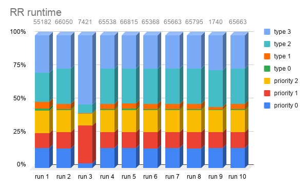

# 3430 A3

Name: Tristan Montilla

ID: 7818872

Section: A01

# Program information
Below are general information regarding the code I have written.
## Compiling
`make`
- Compiles the program which outputs programs: `q1` for question 1 and `q2` for question 2.
- `make -e "FLAGS = -DDEBUG"` compiles the program in debug mode which provides extra information when run. *Not really needed*.
- Makefile made from previous assignment's Makefile (*the ones provided from assignments*)
## Running
`./q1 [sched type#] [optional file]`
- This is to run question 1's code. More about it [here](#Question-1)
- Sched type:
 - 1 : Round Robin
 - 2 : Shortest Time to Completion first
 - 3 : Priority Round Robin
- Optional file : if no file is specified it defaults to **processes.txt**.

Question 2 found [here](#Question-2)

## Design
- Applied defensive programming and design by contract.
- Errors are properly handled and user is informed if something goes wrong.
- `#define` is used mainly for **debug mode** which does not affect program implementation. It is also used for:
 - Number of thread types, priorities, buffer sizes. Mainly numbers that would generally be in a #define.
- **Consistent formatting** used throughout programming. I used visual studio style with my own touches.

# Question 1
Here are all information regarding question 1.
Contents: [scheduling](#Scheduling-algorithms), [runtime](#Runtime) [tables and graphs](#Statistics)
## Scheduling algorithms
As per requirement:
> The scheduling algorithms are time-sharing algorithms, but will be **non-premptive** – a running process can not be preempted. **The process will run for an entire timeslice**, *except for the case that it quits early in the case that it “yields the processor” because it is waiting for I/O*.

#### Round Robin
`./q1 1 [optional file]`

The algorithm runs the first process in queue and it won't stop until completion or when I/O is required.
- When I/O is required then we would stop the process (when 
#### Shortest Time to Completion first
`./q1 2 [optional file]`

STCF, as it was written in the book, is preemtive. But **I will be doing as per requirement** and implement it as non-preemtive.
- I/O will still give up the processor as per requirement.
- STCF will sort the queue by shortest time initially and *throughout the simulation*.
 - Meaning after every run (either by completion or when I/O is required,) the queue will sort itself again by shortest time.
- Lowest processor will not be run if it requires I/O (will move to the next one).

### Priority Round Robin
`./q1 3 [optional file]`

The algorithm queue's up the processes by priority, and whichever comes first.
- It performs a Round Robin on each priority level. Starting at the highest.
- If There are no more, then it goes to a lower priority.
- If I/O is being performed by a process with high priority and it is the only one, it goes to the next lower priority process before coming back to the highest one.
 - This is because I/O is required by the processor.

## Runtime
Runtime is calculated by: `time_finished - time_started`
- This means that this is **different** from the book's *turnaround time* which computes: `time_finished - time_arrived`
- This decision was made because of the naming used and discussions on umlearn.

## Statistics
The distributions generated are significantly different.

RR is erratic and most of its runtime seems heavily impacted by I/O changes.
- On some cases it is good. on some it is bad.
- On average it is the worst.

STCF is consistenct in most cases.
 - 

PRR is the most consistent out of all the three.
- Thread types seems to be the most consistent. It is perhaps of the **dataset** more than anything.
- Priority wise it wins out of the three
- It has the least amount of run time out of the three and is able to consistently maintain it.

### RR Runtime                                                                                    

| run #		     | priority 0     | priority 1 | priority 2 | type 0  | type 1 | type 2 | type 3  |
|----------------|------------|------------|----------|---------|----------|-----------|-----------|
| run 1          | 8391       | 6240       | 9356     | 813     | 2693     | 12054     | 15635     |
| run 2          | 9908       | 8059       | 10828    | 681     | 2527     | 17465     | 16582     |
| run 3          | 267        | 2112       | 651      | 11      | 33       | 478       | 3869      |
| run 4          | 9856       | 7965       | 10754    | 657     | 2428     | 17393     | 16485     |
| run 5          | 10033      | 8133       | 10954    | 919     | 2588     | 17541     | 16647     |
| run 6          | 9804       | 7955       | 10744    | 593     | 2417     | 17381     | 16474     |
| run 7          | 9863       | 7973       | 10793    | 703     | 2436     | 17403     | 16492     |
| run 8          | 9871       | 7975       | 10842    | 670     | 2369     | 17480     | 16588     |
| run 9          | 267        | 208        | 284      | 11      | 33       | 478       | 459       |
| run 10         | 9863       | 7973       | 10793    | 703     | 2436     | 17403     | 16492     |
| average:       | 7812.300   | 6459.300   | 8599.900 | 576.100 | 1996.000 | 13507.600 | 13572.300 |
| std deviation: | 4004.359   | 2882.328   | 4311.494 | 311.134 | 1038.972 | 7069.583  | 6072.954  |

### STCF Runtime

| run #		     | priority 0     | priority 1 | priority 2 | type 0  | type 1 | type 2 | type 3  |
|----------------|------------|------------|---------|--------|--------|---------|----------|
| run 1          | 359        | 381        | 1027    | 11     | 34     | 478     | 1419     |
| run 2          | 590        | 536        | 670     | 22     | 67     | 956     | 898      |
| run 3          | 587        | 535        | 668     | 21     | 65     | 955     | 896      |
| run 4          | 586        | 533        | 666     | 19     | 64     | 953     | 895      |
| run 5          | 433        | 382        | 943     | 11     | 34     | 478     | 1420     |
| run 6          | 588        | 533        | 668     | 20     | 65     | 954     | 896      |
| run 7          | 293        | 622        | 444     | 11     | 34     | 478     | 990      |
| run 8          | 402        | 412        | 947     | 11     | 34     | 478     | 1421     |
| run 9          | 588        | 533        | 668     | 20     | 65     | 954     | 896      |
| run 10         | 469        | 354        | 927     | 11     | 34     | 478     | 1413     |
| average:       | 489.500    | 482.100    | 762.800 | 15.700 | 49.600 | 716.200 | 1114.400 |
| std deviation: | 113.154    | 91.051     | 185.515 | 5.012  | 16.460 | 251.086 | 263.075  |

### PRR Runtime

| run #		     | priority 0     | priority 1 | priority 2 | type 0  | type 1 | type 2 | type 3  |
|----------------|------------|------------|---------|--------|--------|---------|---------|
| run 1          | 267        | 208        | 284     | 11     | 33     | 478     | 459     |
| run 2          | 298        | 234        | 284     | 11     | 34     | 478     | 538     |
| run 3          | 267        | 208        | 284     | 11     | 33     | 478     | 459     |
| run 4          | 298        | 234        | 284     | 11     | 34     | 478     | 539     |
| run 5          | 267        | 208        | 284     | 11     | 33     | 478     | 459     |
| run 6          | 267        | 208        | 284     | 11     | 33     | 478     | 459     |
| run 7          | 267        | 208        | 284     | 11     | 33     | 478     | 459     |
| run 8          | 298        | 234        | 284     | 11     | 34     | 478     | 539     |
| run 9          | 267        | 208        | 284     | 11     | 33     | 478     | 459     |
| run 10         | 267        | 208        | 284     | 11     | 33     | 478     | 459     |
| average:       | 276.300    | 215.800    | 284.000 | 11.000 | 33.300 | 478.000 | 482.900 |
| std deviation: | 14.974     | 12.559     | 0.000   | 0.000  | 0.483  | 0.000   | 38.484  |

